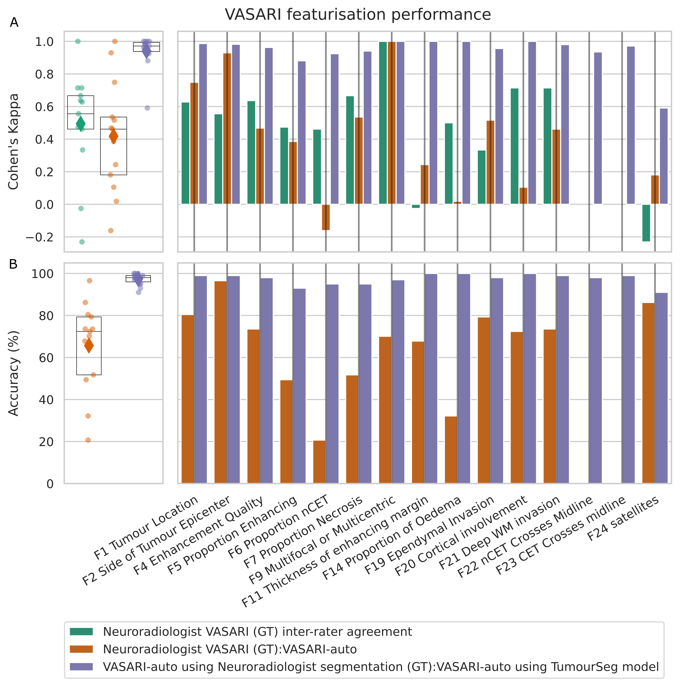
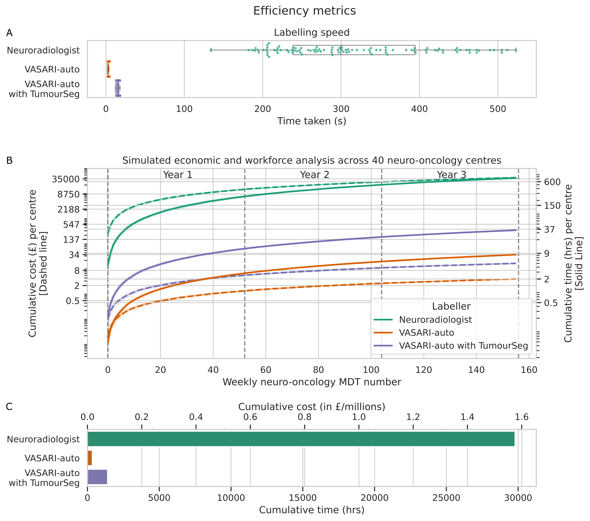
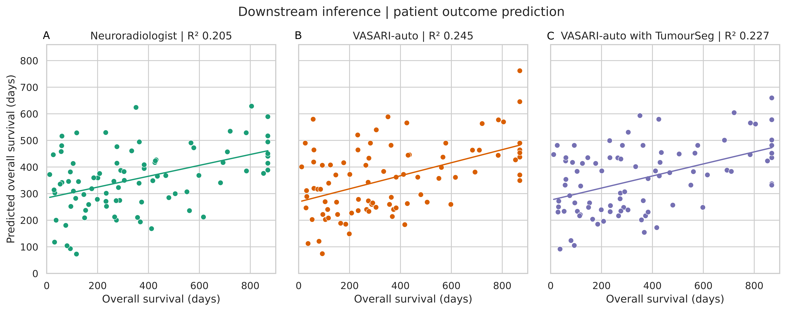
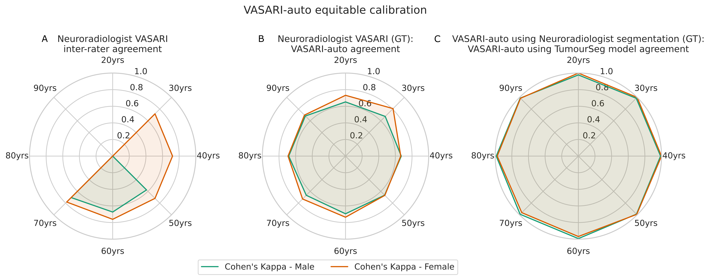
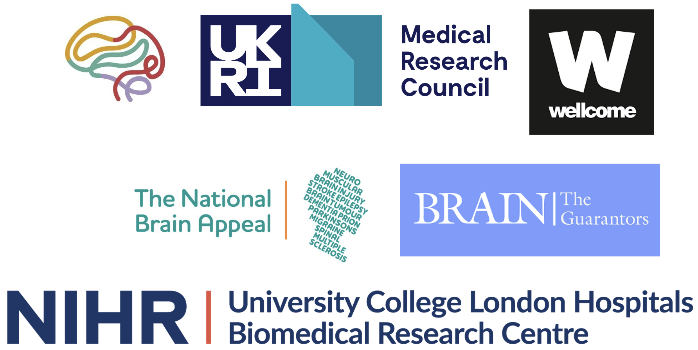

# VASARI-auto
This is a codebase for automated VASARI characterisation of glioma, as detailed in the [article](https://doi.org/10.1016/j.nicl.2024.103668).


## Table of Contents
- [What is this repository for?](#what-is-this-repository-for)
- [Usage](#usage)
- [Advantages](#advantages)
  - [Stable](#stable)
  - [Efficient](#efficient)
  - [Informative](#informative)
  - [Equitable](#equitable)
- [Usage queries](#usage-queries)
- [Citation](#citation)
- [Funding](#funding)

## What is this repository for?
The VASARI MRI feature set is a quantitative system designed to standardise glioma imaging descriptions. Though effective, deriving VASARI is time-consuming to derive manually.

To resolve this, we release VASARI-auto, an automated labelling software applied to open-source lesion masks.

VASARI-auto is a **highly efficient** and **equitable** *automated labelling system*, a **favourable economic profile** if used as a decision support tool, and offers **non-inferior survival prediction**. 

## Usage
VASARI-auto requires **only** a tumour segmentation file only, which allows users to apply code efficiently and effectively on anonymised lesion masks, for example in using the output of our tumour segmentation model ([paper](https://doi.org/10.1093/braincomms/fcad118) | [codebase](https://github.com/high-dimensional/tumour-seg)).

For segmentation files, this code assumes that lesion components are labelled within a NIFTI file as follows:
```
- Perilesional signal change = 2
- Enhancing tumour = 3
- Nonenhancing tumour = 1
```

We include a [Jupyter Notebook tutorial](demo.ipynb) that calls upon the [source code](vasari_auto.py).

## Advantages
### Stable

Relying on tumour segmentation masks and geometry only, VASARI-auto is deterministic, with no variability between inference, in comparison to when cases are reviewed by different neuroradiologists.

### Efficient

The time for neuroradiologists to derive VASARI is substantially higher than VASARI-auto (mean time per case 317 vs. 3 s). 

A UK hospital workforce analysis forecast that three years of VASARI featurisation would demand 29,777 consultant neuroradiologist workforce hours and >£1.5 ($1.9) million, reducible to 332 hours of computing time (and £146 of power) with VASARI-auto.

### Informative

We identify that the best-performing survival model utilised VASARI-auto features instead of those derived by neuroradiologists. 

### Equitable

VASARI-auto is demonstrably equitable across a diverse patient cohort (panels B and C).

## Usage queries
Via github issue log or email to j.ruffle@ucl.ac.uk

## Citation
If using these works, please cite the following [article](https://doi.org/10.1016/j.nicl.2024.103668):

```Ruffle JK, Mohinta S, Pegoretti Baruteau K, Rajiah R, Lee F, Brandner S, Nachev P, Hyare H. VASARI-auto: Equitable, efficient, and economical featurisation of glioma MRI. Neuroimage: Clinical, 2024, 44 (103668).```

## Funding

The Medical Research Council;  Wellcome Trust; UCLH NIHR Biomedical Research Centre; Guarantors of Brain; National Brain Appeal; British Society of Neuroradiology.